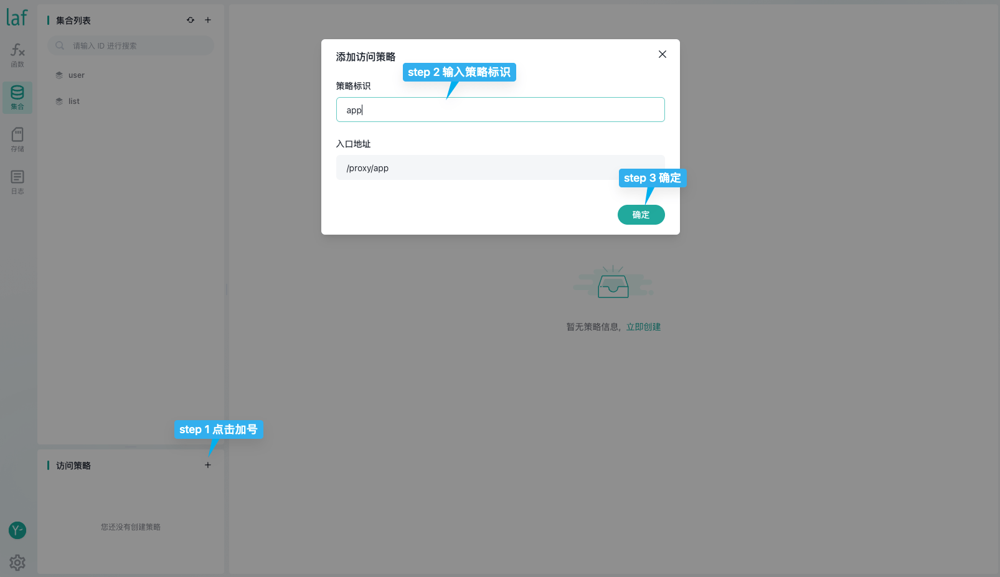

# 访问策略

前端可使用 [laf-client-sdk](https://github.com/labring/laf/tree/main/packages/client-sdk) “直连”数据库，无需与服务端对接口。

访问策略用来对客户端对数据库的操作进行安全控制，一个访问策略由多个集合的访问规则组成，每个集合可配置读写操作权限的访问规则。

开发者可以为应用创建多个访问策略，以供不同的客户端使用。

通常应用可创建两个访问策略：

- `app` 用于用户端客户端的访问策略，一般可以是 App、小程序、H5 等
- `admin` 用于应用的后台管理的访问策略

## 创建策略

首先我们切换到集合页面，按照下面步骤为 user 集合添加一个访问策略。

:::tip
如果你还没有 user 集合就先创建一个。
:::




做完这两步之后，我们就成功的创建了一个访问策略，并且把策略放在了 user 集合上。
这里我们解释一下规则内容：  

```js
{
  "read": true, // 查询权限
  "count": true, // 计数权限
  "update": false, // 修改权限
  "remove": false, // 删除权限
  "add": false // 新增权限
}
```

我们把值设为 true 则代表允许，false 则为不允许，按照我们刚刚默认的规则，前端可以直接对我们的集合进行`查询`和`计数`操作，而增 删 改，是不允许的。  
这里还有另外一个值得留意的地方，就是"入口地址" 刚刚我们设置的策略名称为 app，那么入口地址就是 /proxy/app，接下来演示一下如何使用。

## 前端“直连”

在演示之前我们先往 user 集合中加一点数据。


我们来到前端项目，这里使用 Vue 项目来演示，其他项目同理。

### 首先安装 SDK  

```bash
npm i laf-client-sdk
```

### 然后创建 cloud 对像

这里注意了，我们多填写一个参数 dbProxyUrl，那么它的值就是我们刚刚强调的入口地址 `/proxy/app`

```js
import { Cloud } from "laf-client-sdk";

const cloud = new Cloud({
  baseUrl: "https:/<APP_ID>.laf.run",   // <APP_ID> 在首页应用列表获取
  getAccessToken: () => "",    // 这里不需要授权，先填空
  dbProxyUrl: "/proxy/app", // 这里就填写我们刚刚强调的“入口地址”
})
```

创建完 cloud 对像之后我们尝试一下在前端直接发起查询。

```js
async function get() {
  const res = await cloud.database().collection("user").get();
  console.log(res);
//   {
//   "data": [
//       {
//           "_id": "641d22292de2b789c963e5fd",
//           "name": "jack"
//       },
//       {
//           "_id": "641e87d52c9ce609db4d6047",
//           "name": "rose"
//       }
//   ],
//   "ok": true
// }
}
```

现在我们来试试 count。

```js
async function get() {
  const res = await cloud.database().collection("user").count();
  console.log(res);
  // {
  //   "total": 2,
  //   "ok": true
  // }
}
```

可以看到，简单的查询计数我们已经不需要写云函数，直接在前端即可实现，如果你想体验 `增删改` 可以修改对应策略的权限为 true，但这是一个很危险的行为。

访问策略也可以是表达式，以下为 `users` （用户集合）的访问策略示例：
其中`query` 是数据查询的条件对象，`uid === query._id` 表示该策略只允许当前用户读取自己的用户数据。

```json
  "users"
  {
    "read": "uid === query._id"
  }
```

> 注意： `uid` 为 JWT Payload 中的字段，代表当前登录用户的 ID，你可在云函数中生成 JWT 令牌，其中 payload 中的字段都可在访问策略中使用。

## 验证器

访问规则由一个或多个验证器组成，`"read": true` 使用的是 `condition` 验证器，该验证器接一个表达式来控制是否允许访问。
以上使用的是简写形式，完整的写法如下：

```json
{
  "read": {
    "condition": true
  }
}
```

当前内置了以下验证器：

- `condition` 条件验证器，接受一个表达式，返回真值即代表允许访问，表达式中默认可用对象有
  - `JWT Payloads` JWT 令牌 payload 中的字段，如示例中的 `uid`
  - `query` 数据查询条件
  - `data` 更新或新增数据操作时的数据对象
- `data` 数据验证器，接受一个对象，对「更新或新增数据操作时的数据对象」中的各字段进行验证，具体参考以下示例
- `query` 查询条件对象验证器，接受一个对象，对「查询条件对象」中的各字段进行验证，具体参考以下示例
- `multi` 是否允许批量操作，接受一个表达式做为配置。默认只有 `read` 操作允许批量操作，如需开启其它批量操作需要显式指定此验证器

## 实践建议

初识访问规则，可能会觉其烦琐难以掌握，而且容易写错，或是对其安全性不自信、自知，所以根据我们在大量项目中的实践经验，给出一些建议：

- 最小权限原则，即只给客户端必要的访问权限，只开放给客户端必要的集合；

  - 即便只开放 `read` 权限，也可能节省 30%～ 50% 的后端接口；
  - 再配合一些基本的 `condition` 判断，可有效减少 70%～ 90% 的后端接口；

- 事务性的数据操作、复杂的表单提交，建议使用云函数实现：

  - 云函数与客户端 SDK 接口一致，简单、轻量、快捷，无二次学习成本，调试更容易、无部署负担
  - 云函数中访问数据库，无需编写访问规则，因为云函数是服务端执行的可信代码

- 访问规则虽然也可以完成很多复杂的验证，但是除非你非常熟练的掌握了它，否则建议用云函数来实现这部分逻辑

## 访问规则示例

> 提供几个简单的示例以供参考和理解。

### 简单示例 1：简单个人博客

```json
"categories"
{
  "read": true,
  "update": "uid",
  "add": "uid",
  "remove": "uid"
},
"articles"
{
  "read": true,
  "update": "uid",
  "add": "uid",
  "remove": "uid"
}
```

> 提示：其中类似 `"update": "uid"` 的规则，是 `uid` 不为假值的意思 (undefined | null | false 等)

### 简单示例 2：多用户博客

```json

{
  "read": true,
  "update": "uid === query.author_id",
  "add": "uid === query.author_id",
  "remove": "uid === query.author_id"
}

```

### 复杂示例 1：数据验证

```json
{
  "read": true,
  "add": {
    "condition": "uid === query.author_id",
    "data": {
      "title": { "length": [1, 64], "required": true },
      "content": { "length": [1, 4096] },
      "status": { "boolean": [true, false] },
      "likes": { "number": [0], "default": 0 },
      "author_id": "$value == uid"
    }
  },
  "remove": "uid === query.author_id",
  "count": true
}
```

### 复杂示例 2：更高级的数据验证

> 场景介绍：用户之间站内消息表访问规则

```json
{
  "read": "uid === query.receiver || uid === query.sender",
  "update": {
    "condition": "$uid === query.receiver",
    "data": {
      "read": { "in": [true] }
    }
  },
  "add": {
    "condition": "uid === data.sender",
    "data": {
      "read": { "in": [false] },
      "content": { "length": [1, 20480], "required": true },
      "receiver": { "exists": "/users/id" },
      "read": { "in": [true, false], "default": false }
    }
  },
  "remove": false
}
```

### data 验证器示例

```json
  "categories"
{
  "read": true,
  "update": "role === 'admin'",
  "add": {
    "condition": "role === 'admin'",
    "data": {
      "password": { "match": "^\\d{6,10}$" },
      "author_id": "$value == uid",
      "type": { "required": true, "in": ["choice", "fill"] },
      "title": { "length": [4, 64], "required": true, "unique": true },
      "content": { "length": [4, 20480] },
      "total": { "number": [0, 100], "default": 0, "required": true }
    }
  }
}
```
