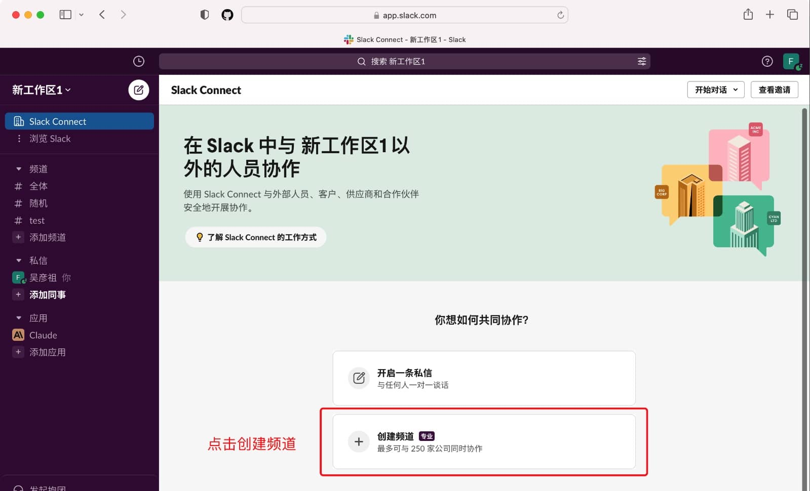
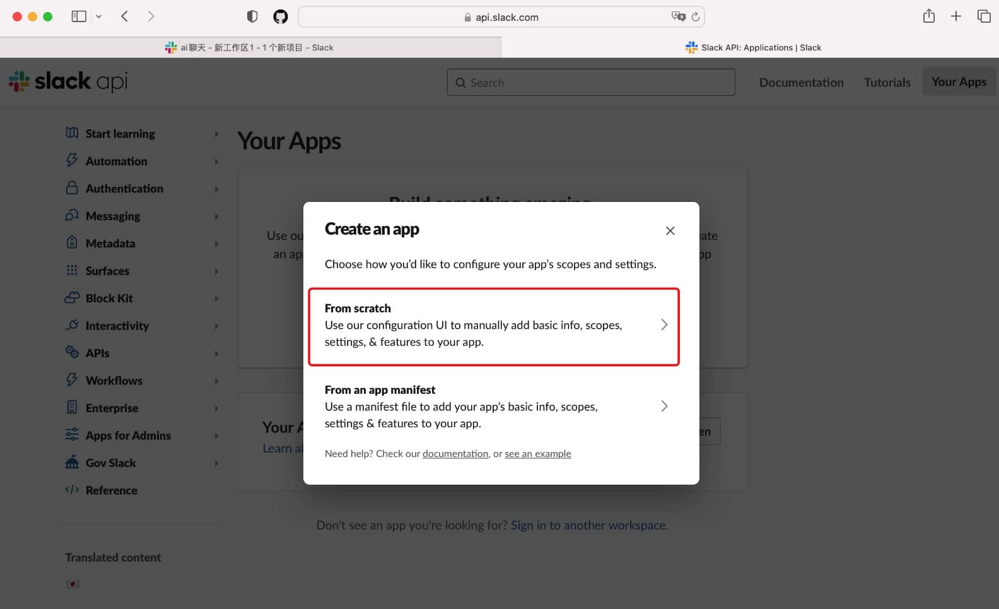
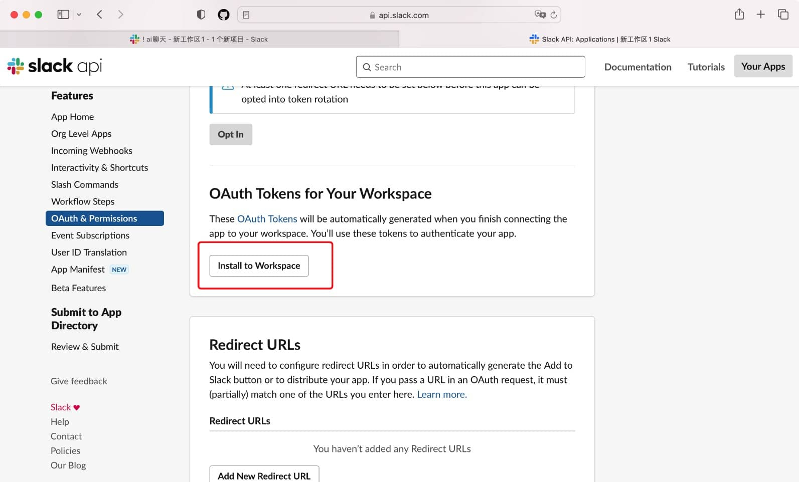

# {{ $frontmatter.title }}

Laf 接入 Claude 是借助了 Slack API，因此国内服务器可以直接调用。

## 申请 Claude in Slack

### 注册 Slack 并创建工作区

需要使用谷歌邮箱注册。

<https://slack.com/>

### 添加 Claude 应用到工作区

此步骤需要使用魔法

<https://www.anthropic.com/claude-in-slack>

### 开通 Slack Connect

谷歌账户注册的 Slack 可以免费试用。

进入工作区后，点击左侧`Slack Connect`，点击创建频道，点击开始免费试用。后续无需续费。





### 与 Claude 对话开通功能

点击应用中的 Claude，任意发送文本。弹出同意按钮，功能开通完成。Claude 可以正常回答问题，即为成功！

### 邀请 Claude 到频道

在需要邀请的频道中 `@Claude`，会提示是否需要邀请 Claude 到频道。

## 配置 slack bot

- 1、登录 slack，<https://app.slack.com/>
- 2、跳转 <https://api.slack.com/>
- 3、创建 APP。点击右上角 `Your Apps`后创建新的 APP




- 4、配置 Scopes。点击左侧边栏的 OAuth & Permissions，找到 Scopes 模块下的 User Token Scopes，点击 Add an OAuth Scopes 按钮，依次搜索添加以下权限

```js
channels:history
channels:read
channels:write
groups:history
groups:read
groups:write
chat:write
im:history
im:write
mpim:history
mpim:write
```

- 5、安装 bot 到工作区，点击 OAuth Tokens for Your Workspace 下的 Install to Workspace 按钮



## 安装依赖

`claude-api-slack`

## 云函数调用

```typescript
import cloud from '@lafjs/cloud'

export default async function (ctx: FunctionContext) {
    const { question, conversationId } = ctx.query
    return await askCluadeAPi(question, conversationId)
}

async function askCluadeAPi(question, conversationId) {
    const token = '' // 机器人 token
    const bot = '' // 机器人 id
    const ChannelName = "" // 频道名称

    // 初始化 claude
    const { Authenticator } = await import('claude-api-slack')

    // 通过缓存保存客户端，可以避免每次提问都是在新会话
    let claudeClient = cloud.shared.get('claudeClient')
    if (!claudeClient) {
        claudeClient = new Authenticator(token, bot)
        cloud.shared.set('claudeClient', claudeClient)
    }
    // 创建频道并返回房间 ID：channel
    const channel = await claudeClient.newChannel(ChannelName)

    let result
    if (conversationId) {
        result = await claudeClient.sendMessage({
            text: question,
            channel,
            conversationId,
            onMessage: (originalMessage) => {
                console.log("loading", originalMessage)
            }
        })
    } else {
        result = await claudeClient.sendMessage({
            text: question,
            channel,
            onMessage: (originalMessage) => {
                // console.log("loading", originalMessage)
                console.log("loading", originalMessage)
            }
        })
    }
    console.log("success", result)
    return {
        code: 0,
        msg: result.text,
        conversationId: result.conversationId
    }
}
```

>注意事项：需要将 api 实例保存到缓存中才可以保留上下文
