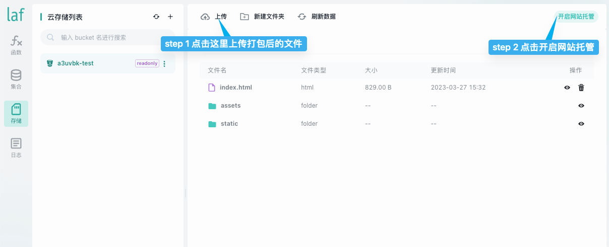
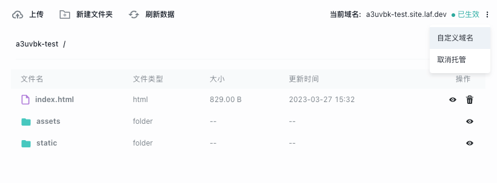

# {{ $frontmatter.title }}

## 简介

静态托管是基于云存储提供的网站托管服务。

可通过「开发控制台」或 `laf-cli` 将网页静态文件上传到云存储的 bucket 中，

静态托管会为你的网站自动提一个独立的域名，也可以绑定自定义域名。

## 如何使用？

- 将开发好的项目打包。
- 创建一个 bucket，将打包后的项目丢进去。
- 点击开托管，上线成功！

## 绑定自有域名

Laf 静态网站托管支持绑定自己的域名，并自动生成 `SSL` 证书，兼容 `https` 和 `http` 访问

@see [绑定自有域名步骤](#上线成功)

## 演示

### 创建 bucket


### 上传文件，开启网站托管

上传前端项目编译后的文件到刚刚新建的云存储中。

::: tip
大部分前端项目编译完的代码都在 `dist` 文件夹中，直接上传 `dist` 文件夹，即可将文件夹中全部文件上传到云存储中
:::



### 上线成功

这样我们就上线成功了，点击链接即可访问，当然我们也可以点击自定义域名来绑定自己的域名。

::: tip
绑定自己的域名后，Laf 将会自动为您的域名配置 `SSL` 证书，这个过程会有 30 秒 -2 分钟，之后即可通过 `https` 进行访问
:::



## 自动化构建前端并发布

> 利用 `Github Actions` 即可实现自动化构建前端并推送到 Laf 云存储中

### 方式一：结合 Laf cli

<!-- /guide/cli/#登录 -->

1、在自己的前端项目的主分支中，新建 Actions，下面是一个基础模板

本模板效果是，如果有新代码推送到主分支，会自动触发 Actions

- `API_URL` 为你当前的 Laf 应用的 API 地址，如：`laf.dev` 对应 `https://api.laf.dev`，`laf.run` 对应 `https://api.laf.run`

- `WEB_PATH` 为你前端在当前项目的哪个路径，如果前端项目在根目录，则无需修改。如果在 web 目录下，则改成 `'web'` 即可。

- `DIST_PATH` 为编译后的目录名称，绝大部分项目编译后的目录名均为 dist

```yaml
name: Build
on:
  push:
    branches:
      - '*'

env:
  BUCKET_NAME: ${{ secrets.DOC_BUCKET_NAME }}
  LAF_APPID: ${{ secrets.LAF_APPID }}
  LAF_PAT: ${{ secrets.LAF_PAT }}
  API_URL: 'https://api.laf.dev'
  WEB_PATH: .
  DIST_PATH: 'dist'
jobs:
  build:
    runs-on: ubuntu-latest
    steps:
      - uses: actions/checkout@v3
      - name: Setup Node.js
        uses: actions/setup-node@v3
        with:
          node-version: '16.x'
      # 安装项目依赖
      - name: Install Dependencies
        working-directory: ${{ env.WEB_PATH }}
        run: npm install
      # 编译项目
      - name: Build
        working-directory: ${{ env.WEB_PATH }}
        run: npm run build
      # 安装 laf-cli
      - name: Install Laf-CLI
        run: npm i laf-cli -g
      # 登录 laf api
      - name: Login laf-cli
        working-directory: ${{ env.WEB_PATH }}
        run: |
          laf user add ${{ env.LAF_APPID }} -r ${{ env.API_URL }}
          laf user switch ${{ env.LAF_APPID }}
          laf login $LAF_PAT
      # 初始化 Laf 应用然后将编译好的代码推送到云存储
      - name: Init appid and push
        working-directory: ${{ env.WEB_PATH }}
        env:
          LAF_APPID: ${{ env.LAF_APPID }}
        run: |
          laf app init ${{ env.LAF_APPID }}
          laf storage push -f ${{ env.BUCKET_NAME }} ${{ env.DIST_PATH }}/
```

2、配置一些环境变量

- `DOC_BUCKET_NAME` 为你的前端托管的 bucket 名称

- `LAF_APPID` 为你的 Laf 应用 appid

- `LAF_PAT` 为你的 Laf 应用的 PAT，获取方法可看：[获取 PAT](/guide/cli/#登录)

将上面 3 个参数配置到项目的密钥中


第一步：点击 `settings`


第二步：点击 `Secrets and variables` 下的 `Actions`

第三步：依次添加 `DOC_BUCKET_NAME` `LAF_APPID` `LAF_PAT`

### 方式二：使用 Github Action 模板

1、获取 Access Key 和 Secret 等配置参数
查看详细文档：[生成云存储临时令牌 (STS)](/guide/oss/get-sts.md)


2、编写 Github Action

```yaml
name: Build
on:
  push:
    branches:
      - '*'

env:
  BUCKET_NAME: ${{ secrets.DOC_BUCKET_NAME }}
  OSS_ID: ${{ secrets.OSS_ID }}
  OSS_SECRET: ${{ secrets.OSS_SECRET }}
  OSS_ENDPOINT: 'https://oss.laf.dev'
  OSS_REGION: 'sg'
  STS_TOKEN: ${{ secrets.STS_TOKEN }}
  DIST_PATH: 'dist'
jobs:
  build:
    runs-on: ubuntu-latest
    steps:
      - uses: actions/checkout@v3
      - name: Setup Node.js
        uses: actions/setup-node@v3
        with:
          node-version: '16.x'
      # 安装项目依赖
      - name: Install Dependencies
        working-directory: ${{ env.WEB_PATH }}
        run: npm install
      # 编译项目
      - name: Build
        working-directory: ${{ env.WEB_PATH }}
        run: npm run build
      # 上传部署
      - name: Laf OSS Upload
        uses: 0fatal/laf-oss-upload@main
        with:
          endpoint: ${{ env.OSS_ENDPOINT }}
          region: ${{ env.OSS_REGION }}}
          access-key-id: ${{ env.OSS_ID }}
          access-key-secret: ${{ env.OSS_SECRET }}
          sts-token: ${{ env.STS_TOKEN }}
          bucket: ${{ env.BUCKET_NAME }}
          target-dir: ${{ env.DIST_PATH }}
```

3、配置环境变量

4、提交代码到仓库触发自动化构建和部署
